<div align="center">

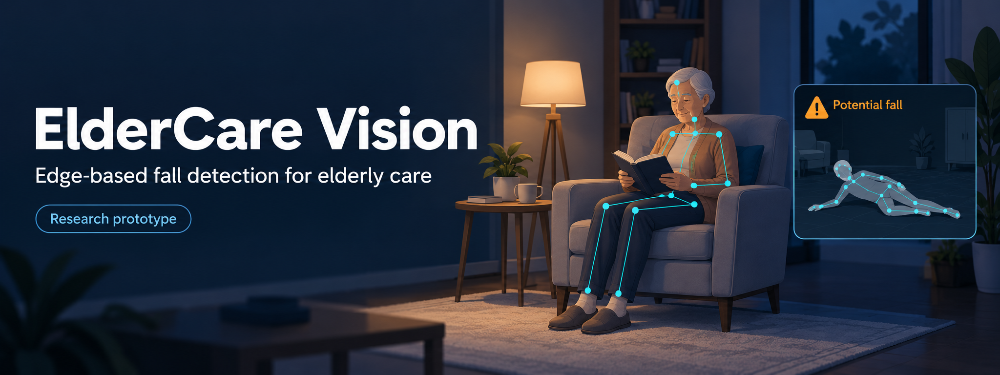

# ElderCare Vision

**Camera-based fall detection that runs on your own hardware, keeps video in the room, and alerts a caregiver within about a second.**

[](https://www.python.org/)
[](https://docs.ultralytics.com/)
[](https://pytorch.org/)
[](https://streamlit.io/)
[](https://fastapi.tiangolo.com/)
[](tests)
[](#limitations)

[Results](#results) · [How it works](#how-it-works) · [Architecture](#architecture) · [Quickstart](#quickstart) · [Demo app](#the-demo-app) · [Evaluation story](#how-we-got-here) · [Limitations](#limitations)

</div>

> [!WARNING]
> **Research prototype, not a medical device.** ElderCare Vision is not certified for clinical or emergency use. Don't rely on it as the only way to detect a fall or call for help.

---

## Why this exists

Falls are a leading cause of injury for older adults, and the risk goes up when someone lives alone and can't reach a phone. Wearables only help when they're worn and charged. Cloud cameras send private footage off-site.

ElderCare Vision takes a different approach:

- **It looks at skeletons, not faces.** A pose model reduces each person to 17 body points. Fall logic only ever sees those points.
- **It runs on the edge.** Inference runs on a local GPU (developed on an RTX 3070), with a CPU fallback. Video doesn't leave the building.
- **A person makes the final call.** Each alert is saved with snapshots. A caregiver confirms or rejects it, and confirmed labels can be exported as new training data.

<div align="center">
  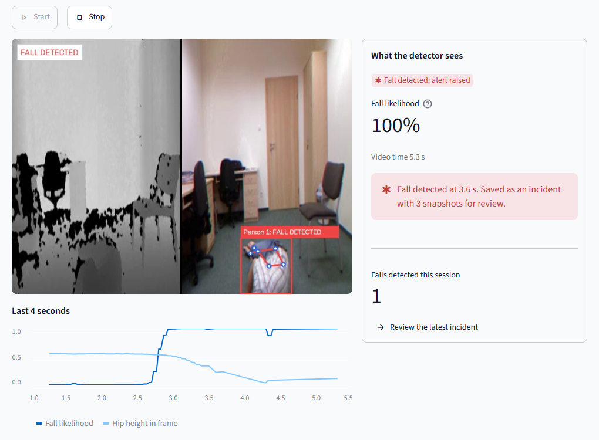
  <br>
  <sub>The live demo on a staged fall from the public URFD dataset. Fall likelihood jumps while hip height drops and stays low, and the alert is saved as an incident.</sub>
</div>

## Results

The frozen **V6.3** model was evaluated **once**, after the freeze, on a sealed test set it never saw during development: 132 UP-Fall clips from 2 camera views.

| Metric | Result | 95% CI | Target |
|---|---|---|---|
| **Recall** (falls caught) | **98.3%** (59/60) | 91.1–99.7 | ≥ 90% ✅ |
| **Precision** (alerts that were real falls) | **96.7%** | 88.8–99.1 | ≥ 85% ✅ |
| **Time to alert** | median **0.85 s**, p95 **1.58 s** | | p95 ≤ 3 s ✅ |
| Specificity (everyday clips with no alert) | 98.6% (71/72) | | |
| False alarms, 0.83 h held-out home video | 0 alerts | upper bound 3.6 /h | ≤ 0.05 /h ⚠️ not yet proven |

Errors on the sealed set: one missed `fall_forward_hands` on camera 2, one false alert while lying down, and one duplicate alert inside a fall clip.

The false-alarm target needs roughly 60 h or more of held-out everyday footage to prove, so it's reported as unproven. Full report: [`V6_FINAL_RESULTS.md`](docs/reports/V6_FINAL_RESULTS.md).

## How it works

<div align="center">
  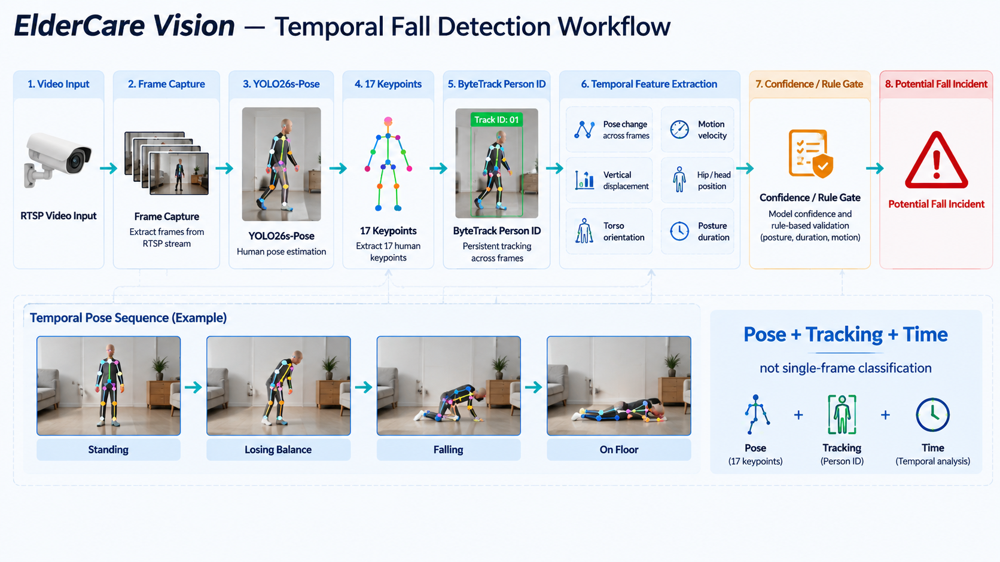
</div>

The key idea is **pose + tracking + time**: a fall is a sequence of frames, not a single image.

1. **Find the body.** YOLO26s-pose marks 17 keypoints on every person at 15 Hz. Malformed or non-finite detections are dropped before they reach the fall logic.
2. **Follow each person.** ByteTrack keeps IDs stable through crossings and occlusion. A causal track stitcher rejoins a person whose ID changes mid-fall.
3. **Read the motion.** A per-track 1D CNN-GRU reads 2-second windows of scale-normalised skeleton features and outputs `p_normal`, `p_falling` and `p_fallen`.
4. **Decide.** An alert fires only when a kinetic trigger (`p_falling ≥ 0.55`) is followed within 3 s by low posture that lasts 0.45 s. Low posture comes from the classifier, a floor-geometry check, or body-normalised descent. This is what separates a fall from sitting down or bending over. After an alert, the track can't alert again until the person is upright.
5. **Review and learn.** Each incident stores snapshots from 3 s and 1.5 s before the alert and at the alert. An optional vision-language model adds a second opinion. A caregiver gives the final label.

<div align="center">
  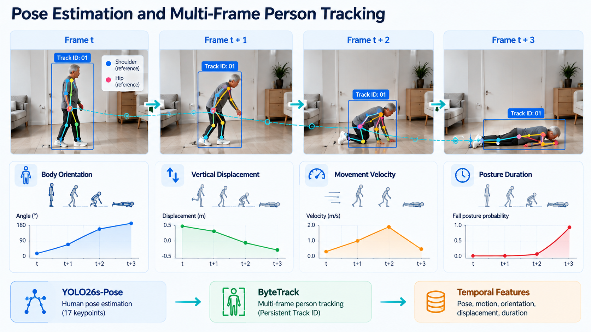
  <br>
  <sub>Each tracked person yields a time series of orientation, hip height, velocity and posture. These are the signals the classifier and decision gate read.</sub>
</div>

## Architecture

<div align="center">
  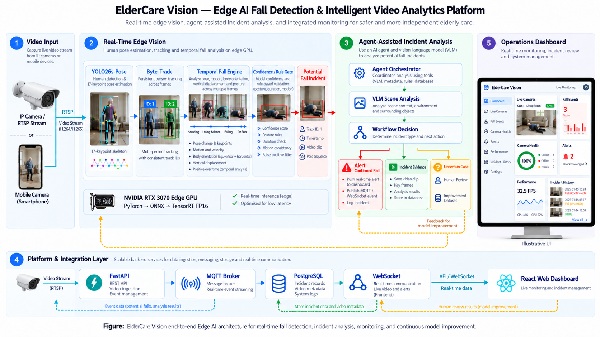
</div>

<table>
  <tr>
    <td width="50%" valign="top">
      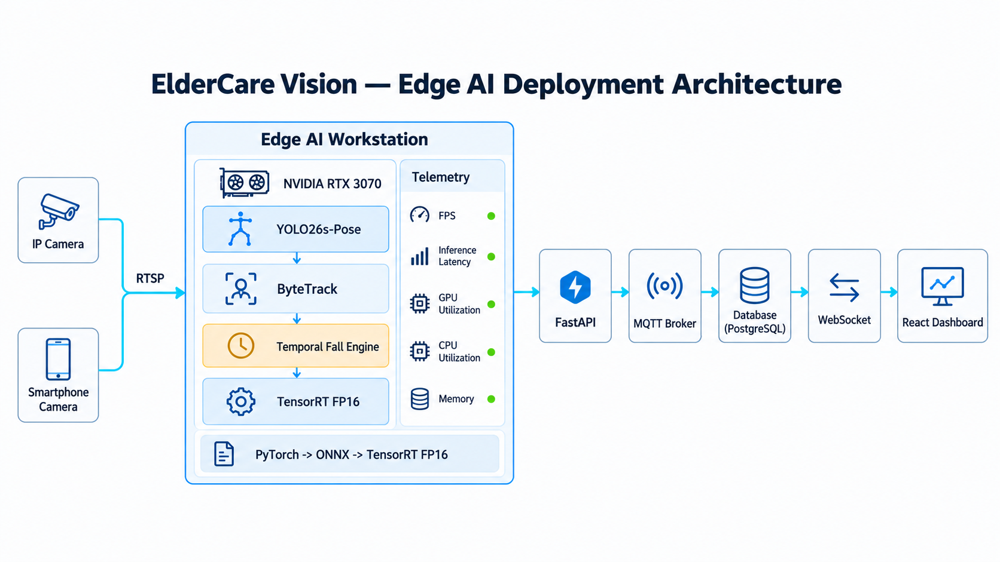
      <p><b>Edge deployment.</b> Inference stays on a local GPU workstation. The pose model is exported PyTorch → ONNX → TensorRT FP16, and events flow out through FastAPI, MQTT and WebSocket.</p>
    </td>
    <td width="50%" valign="top">
      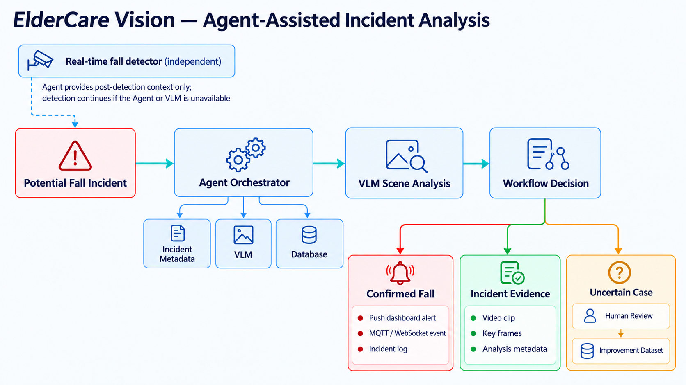
      <p><b>Agent-assisted analysis.</b> The VLM agent only adds context after a detection. Detection keeps working if the agent or VLM is unavailable (<a href="docs/adr/ADR-003-agent-decoupling.md">ADR-003</a>).</p>
    </td>
  </tr>
  <tr>
    <td width="50%" valign="top">
      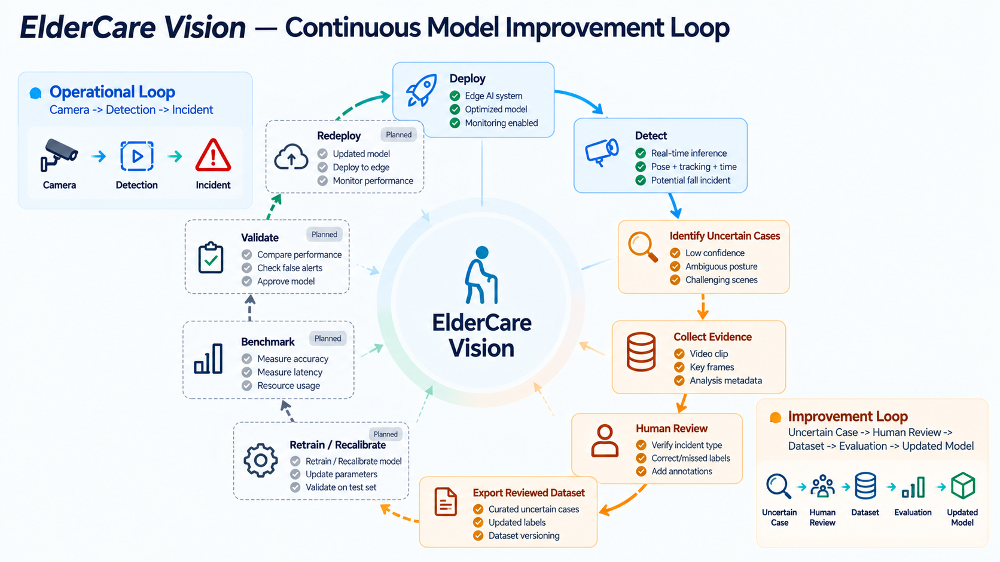
      <p><b>Improvement loop.</b> Reviewed incidents export to a versioned dataset. The detect → review → export half is built. Retrain → validate → redeploy is planned.</p>
    </td>
    <td width="50%" valign="top">
      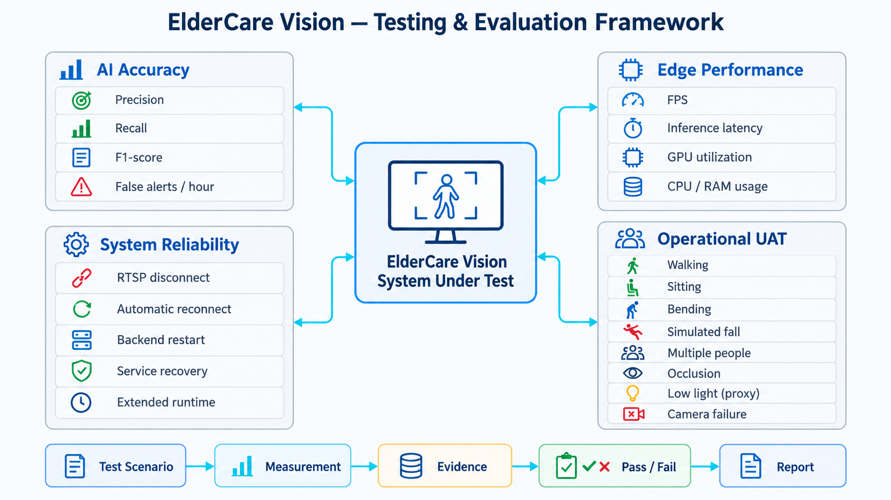
      <p><b>Testing framework.</b> Every claim goes through scenario → measurement → evidence → pass/fail → report, across accuracy, edge performance, reliability and UAT.</p>
    </td>
  </tr>
</table>

<sub>Diagrams are concept illustrations of the design. People and dashboard numbers in them are illustrative, not measured results. Measured results are in <a href="#results">Results</a>.</sub>

## Features

| | |
|---|---|
| 🦴 **Pose-only fall logic** | Classifiers see keypoints, never raw pixels or identities |
| 👥 **Multi-person** | Every tracked person gets an independent classifier and state machine |
| ⏱️ **Fast alerts** | Median 0.85 s from fall start to alert on the sealed test set |
| 🧪 **Leak-free evaluation** | Grouped CV, sealed splits, SHA-256 freeze manifests, Wilson/Poisson CIs |
| 🤖 **Optional VLM second opinion** | Off by default. Works with on-prem OpenAI-compatible servers such as Ollama or vLLM, behind a privacy boundary |
| 🧑‍⚕️ **Human-in-the-loop review** | Review queue, AI-flagged filter, and export of reviewed labels to JSONL |
| 🔌 **Integration ready** | FastAPI REST + WebSocket, MQTT events, SQLAlchemy/Alembic (SQLite or PostgreSQL), React dashboard |
| ⚡ **Edge runtime** | ONNX and TensorRT FP16 export for the pose model, with automatic CPU fallback |

## Quickstart

**Requirements:** Python 3.10+, [`uv`](https://docs.astral.sh/uv/), and optionally an NVIDIA GPU with CUDA. Everything also runs on CPU, just slower.

```bash
git clone https://github.com/luqshzeeq3601-art/Fall-Detection-Yolo26.git
cd Fall-Detection-Yolo26

# Install the app, ML stack and test tools from the lockfile
uv sync --extra train --extra test
```

**1. Get the pose model.** Ultralytics downloads the YOLO26s-pose weights on first use:

```bash
uv run python -c "from ultralytics import YOLO; YOLO('yolo26s-pose.pt')"
```

The frozen V6.3 fall classifier ships with the repo in [`models/v6_3_phase3b/`](models/v6_3_phase3b), and its SHA-256 is recorded in `freeze_manifest.json`.

**2. (Optional) Fetch sample clips.** These are the URFD videos used by the demo's *Fall example* and *Everyday activity* sources:

```bash
uv run python scripts/dataset/download_urfd.py
```

**3. Launch the demo:**

```bash
uv run streamlit run streamlit_app.py
```

Open <http://localhost:8501>.

## The demo app

| Overview | Results |
|---|---|
| 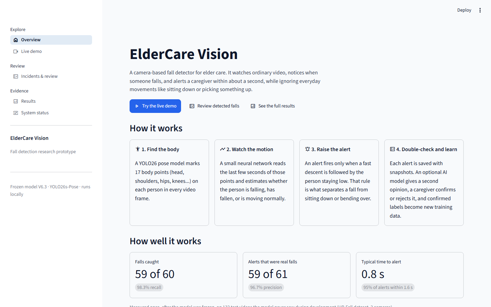 | 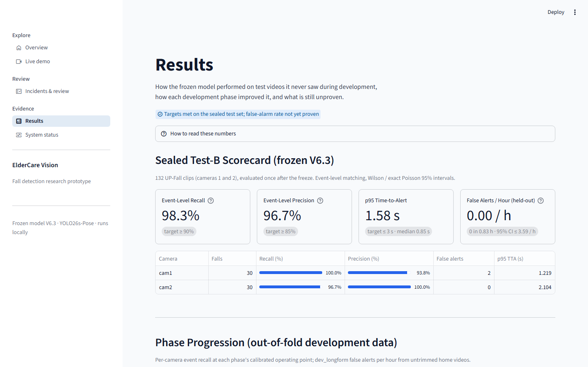 |
| **What it does, how it works, and how well, in plain language** | **Sealed scorecard, per-camera breakdown and phase-by-phase progress** |

| Incidents & review | |
|---|---|
| 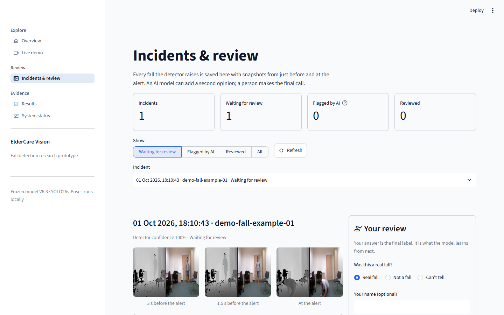 | **Live demo:** run the detector on a sample clip, your own video or a webcam.<br><br>**Incidents & review:** every alert with snapshots, an optional AI opinion and the caregiver's verdict.<br><br>**System status:** pipeline telemetry and runtime health. |

### Optional: VLM second opinion

Enrichment is off by default. Turn it on with environment variables:

| Variable | Values | Default |
|---|---|---|
| `VLM_PROVIDER` | `none`, `mock`, `openai_compat`, `http` | `none` |
| `VLM_BASE_URL` | e.g. `http://localhost:11434` (Ollama) | `http://localhost:11434` |
| `VLM_MODEL` | any vision model your server hosts | `vlm-default` |
| `VLM_API_KEY` | only if your server needs one | none |
| `VLM_TIMEOUT_SECONDS` / `VLM_MAX_RETRIES` | numbers | `5.0` / `2` |

The VLM can flag an incident for review but never overrides the detector or the caregiver.

### REST API

```bash
uv run uvicorn eldercare.api.app:create_app --factory --port 8000
```

This serves health, cameras, incidents and system routes plus a WebSocket feed. Interactive docs are at <http://localhost:8000/docs>.

## Reproduce the pipeline

Datasets aren't redistributed. Download them from their original sources (see [Acknowledgements](#acknowledgements)), then:

```bash
# 1. Ingest datasets and lock the master manifest (subject-disjoint splits)
uv run python scripts/dataset/ingest_v6.py

# 2. Extract 15 Hz multi-person pose caches (YOLO26s-pose + ByteTrack)
uv run python scripts/dataset/extract_pose_cache.py --cache-dir datasets/cache/poses_mp --device 0

# 3. Train M1/M2 with 5-fold grouped CV (V6.3 settings)
uv run python scripts/dataset/train_v6.py --cache-dir datasets/cache/poses_mp \
    --feature-set v2 --stitch-tracks --balance-cameras --output-dir models/my_run

# 4. Calibrate the decision thresholds on out-of-fold signals
uv run python scripts/dataset/calibrate_event_v6_1.py --cache-dir datasets/cache/poses_mp --models-dir models/my_run

# 5. Evaluate event-level metrics with confidence intervals
uv run python scripts/dataset/evaluate_v6.py --models-dir models/v6_3_phase3b \
    --cache-dir datasets/cache/poses_mp --split all_heldout --allow-sealed
```

The exact settings of the frozen model are recorded in [`freeze_manifest.json`](models/v6_3_phase3b/freeze_manifest.json).

> [!NOTE]
> The sealed Test-B split has already been used once for the official result. Re-running it is fine for checking reproducibility, but numbers you tune against it are no longer held-out results.

## How we got here

This project's main lesson is that **how you evaluate matters as much as the model**. Earlier versions reported numbers that didn't hold up. Each phase below fixed a real problem found by auditing the pipeline.

| Stage | Dev recall<br>cam1 / cam2 / URFD | Test-X recall | What changed |
|---|---|---|---|
| V6.1 as first reported | n/a | 2% | Reported 0.58 false alarms/h, which turned out to be a leak |
| Phase 0: evaluation integrity | 71% / 10% / 47% | 2% | Clips from the same video had landed in different CV folds. The honest out-of-fold rate was 4.63 /h |
| Phase 2: multi-person caches | 99% / 49% / 87% | 30% | The cache kept only `persons[0]`, which on camera 2 was often a seated bystander |
| Phase 3: track handover fix | 96% / 69% / 87% | 57% | Handed-over tracks could never trigger an alert |
| **Phase 3b: body-normalised descent (frozen)** | **99% / 90% / 97%** | **87%** | Recovered falls toward the camera, where foreshortening hid "lying down" |

Earlier phases (V1–V5) and a negative result with hard-negative mining are documented in [`docs/reports/`](docs/reports). Figures from phases 11.5–11.6 were [withdrawn as evidence](docs/reports/P11.7-001-evidence-correction-note.md) once they were found to be synthetic.

## Limitations

- **The false-alarm rate is unproven.** There were 0 alerts in 0.83 h of held-out footage, so the 95% upper bound is 3.6 /h against a 0.05 /h goal. Development footage shows 0.70 /h.
- **The test set shares people with the development data.** Test-B uses new recordings of UP-Fall subjects 12–17, so it measures generalisation to new videos, not to new people.
- **The data comes from a lab.** Falls are staged by young adults onto mattresses in one lab with two camera views. Real homes and older adults may perform worse.
- **Sitting, bending and lying cause false triggers.** On URFD everyday clips, development precision is 67%.
- **Tracking is the weak link.** On about 20% of development clips from camera 2, the falling person isn't tracked through the whole fall.

## Roadmap

- [ ] Measure the false-alarm rate on about 80 h of Charades everyday footage, which is already ingested
- [ ] Evaluate on people and rooms the model has never seen
- [ ] Improve re-identification through falls and add more varied everyday negatives
- [ ] Containerise the vision, API and agent services (Compose wiring exists, Dockerfiles pending)

## Project structure

```text
Fall-Detection-Yolo26/
├── src/eldercare/            # Installable package
│   ├── vision/               # Capture, pose inference, tracking, telemetry
│   ├── fall_engine/          # Features, classifiers, state machines, calibration, evaluation
│   ├── incidents/            # Incident service, repository, reviewed-data export
│   ├── agents/               # VLM providers, orchestrator, privacy boundary
│   ├── api/                  # FastAPI app: REST + WebSocket
│   └── db/ · evidence/ · mqtt/
├── app/ + streamlit_app.py   # Streamlit demo
├── frontend/                 # React + Vite operator dashboard
├── config/                   # Detector, tracker and camera configs
├── models/                   # Frozen models and freeze manifests
├── datasets/                 # Manifests only; raw videos and caches are git-ignored
├── scripts/                  # Dataset ingest, training, evaluation, TensorRT export
├── experiments/              # Archived V3/V4 studies and the evidence audit
├── benchmarks/               # Runtime benchmark harness and results
├── tests/                    # Unit, integration, system and AI-regression tests
├── uat/                      # User acceptance test cases and report
├── deployment/ + docker-compose.yml
└── docs/
    ├── adr/                  # Architecture Decision Records
    ├── reports/              # Phase and final evaluation reports
    ├── planning/             # PRD, architecture, AI spec, test and dataset plans
    └── images/
```

## Development

```bash
uv run pytest tests/ -v     # 1,287 tests, CPU-only, no GPU needed
uv run ruff check .
```

Design decisions are recorded as [Architecture Decision Records](docs/adr). Examples include why YOLO26s-pose ([ADR-001](docs/adr/ADR-001-yolo26s-pose.md)), why TensorRT FP16 ([ADR-002](docs/adr/ADR-002-tensorrt-primary.md)) and why the VLM is decoupled from detection ([ADR-003](docs/adr/ADR-003-agent-decoupling.md)).

## Acknowledgements

- **[UR Fall Detection Dataset (URFD)](http://fenix.ur.edu.pl/~mkepski/ds/uf.html)**: Kwolek & Kepski, University of Rzeszów. Sample frames in this README come from URFD.
- **[UP-Fall Detection Dataset](https://sites.google.com/up.edu.mx/har-up/)**: Martínez-Villaseñor et al., Universidad Panamericana.
- **[Ultralytics YOLO](https://github.com/ultralytics/ultralytics)** for pose estimation and **[ByteTrack](https://github.com/ifzhang/ByteTrack)** for multi-object tracking.

Each dataset has its own license and terms of use. Please follow them when you download and use the data.

## License

Released under the [MIT License](LICENSE). Third-party models and datasets keep their own licenses.

<div align="center">
<sub>Built by <a href="https://github.com/luqshzeeq3601-art">@luqshzeeq3601-art</a> as an AI vision engineering portfolio project. If it helped you, consider giving it a ⭐</sub>
</div>
