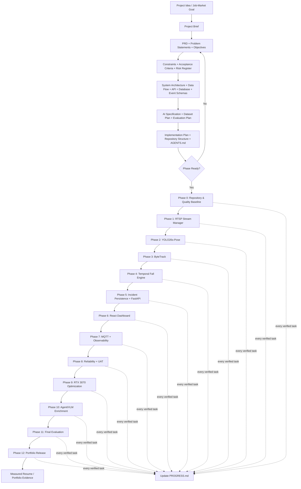
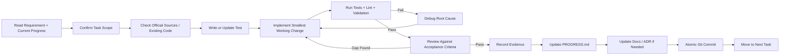
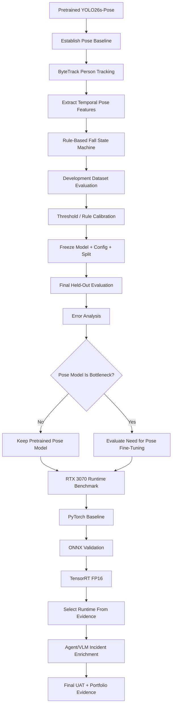
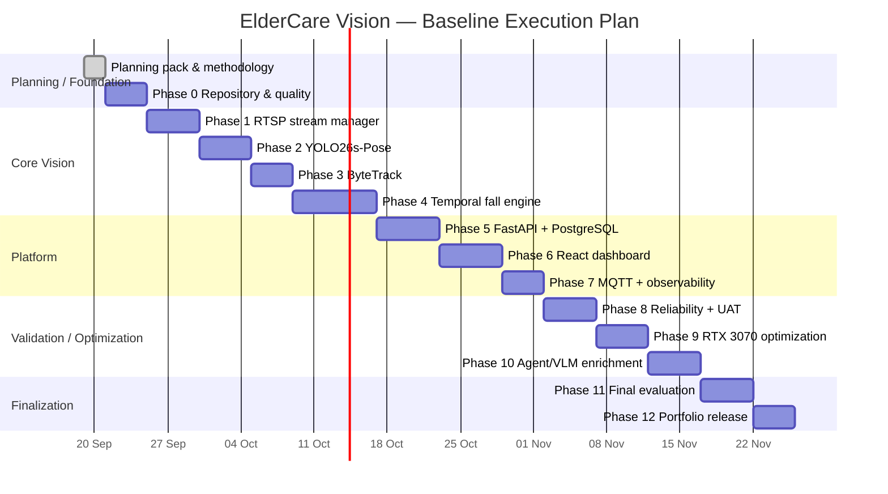

# Project Methodology — ElderCare Vision

## 1. Methodology

ElderCare Vision uses a **hybrid Project Management + AI/ML Engineering + Software Engineering lifecycle**.

The methodology combines:

- requirements-first planning,
- specification-driven development,
- incremental implementation,
- test-driven development for deterministic logic,
- source-driven development for version-sensitive libraries,
- measurable AI/ML evaluation,
- risk-based validation,
- benchmark-before-claim discipline,
- continuous progress tracking.

Primary execution principle:

```text
Define → Plan → Build → Verify → Review → Measure → Document → Progress Update
```

No task is considered complete until verification evidence exists and `PROGRESS.md` has been updated.

---

## 2. Project-Level Flowchart



---

## 3. Per-Task Engineering Loop

Every implementation task follows this loop:



### Mandatory task completion order

```text
Implement
→ Test
→ Verify acceptance criteria
→ Record evidence
→ Update PROGRESS.md
→ Commit
```

A task must **not** be marked complete because code was merely written.

---

## 4. AI / Computer Vision Methodology



### AI methodology rules

- Do not classify falls from one frame.
- Do not tune using final-test data.
- Do not fine-tune YOLO26s-Pose before proving pose quality is the bottleneck.
- Keep dataset splits sequence/subject-disjoint.
- Report failed targets honestly.
- Preserve model, configuration, dataset split and Git commit for every final evaluation.

---

## 5. Dataset Methodology

```text
Official YOLO26s-Pose
        │
        └── COCO-Pose pretrained human keypoints

UR Fall Detection
        │
        ├── development/tuning sequences
        └── frozen final-test sequences

UP-Fall RGB subset
        │
        └── secondary cross-dataset robustness

Local controlled IP-camera clips
        │
        └── deployment-domain UAT
```

### Dataset process

1. Download externally.
2. Verify license/source.
3. Create manifest.
4. Assign complete sequences/subjects to splits.
5. Never commit raw large datasets.
6. Cache derived keypoints only with model/config metadata.
7. Freeze final-test manifest before final evaluation.

---

## 6. Validation Methodology

| Layer | Validation |
|---|---|
| Code | Unit tests, lint, type checks |
| Component | Stream, tracking, fall engine, persistence |
| Integration | FastAPI, PostgreSQL, WebSocket, MQTT |
| AI | Precision, Recall, F1, false alerts/hour |
| Runtime | FPS, p50/p95 latency, CPU/GPU/RAM/VRAM |
| Reliability | Disconnect/reconnect, provider failure, queue overload |
| UAT | End-to-end operational scenarios |
| Security | Secret handling, validation, evidence-path protection |
| Portfolio | Claims backed by reproducible results |

---

## 7. Phase Gates

| Phase | Gate |
|---|---|
| 0 | Repository, CI and quality tooling operational |
| 1 | Stable RTSP ingest + reconnect |
| 2 | YOLO26s-Pose produces normalized observations |
| 3 | ByteTrack + bounded track history verified |
| 4 | Temporal fall engine passes synthetic and development tests |
| 5 | Incidents persist and API contracts pass |
| 6 | Operator can inspect/review incidents |
| 7 | Telemetry + MQTT work without coupling failures |
| 8 | Critical UAT and failure tests pass |
| 9 | RTX 3070 benchmark completed and runtime selected |
| 10 | Agent/VLM works asynchronously without affecting core detector |
| 11 | Frozen final evaluation completed |
| 12 | Documentation, demo and evidence ready |

---

## 8. Gantt Chart

Planned baseline schedule starting **21 September 2026**.

This is a planning baseline. Actual completion is recorded in `PROGRESS.md`.



---

## 9. Milestones

| Milestone | Definition |
|---|---|
| M1 — Foundation Ready | Repo, CI, Docker and quality tooling operational |
| M2 — Vision Baseline | RTSP + YOLO26s-Pose + ByteTrack working |
| M3 — Fall Detection | Temporal fall engine validated |
| M4 — Full Application | Backend + dashboard + persistence working |
| M5 — Reliable Edge System | Monitoring, recovery and UAT complete |
| M6 — Optimized RTX 3070 | TensorRT benchmark and runtime decision complete |
| M7 — Intelligent Workflow | Agent/VLM enrichment working asynchronously |
| M8 — Portfolio Release | Final metrics, documentation and demo ready |

---

## 10. Progress Tracking Method

`PROGRESS.md` is the live state of the project.

It must contain:

- current phase,
- current task,
- overall status,
- completed tasks,
- active tasks,
- blocked tasks,
- evidence/tests,
- important decisions,
- next task,
- progress log.

### Required update trigger

Update `PROGRESS.md` immediately after:

- completing a task,
- failing a task and discovering a blocker,
- changing an architecture decision,
- changing model/runtime/dataset configuration,
- completing a benchmark,
- completing UAT/evaluation.

### Source of truth hierarchy

```text
PRD / Constraints / Architecture
        ↓
Implementation Plan
        ↓
PROGRESS.md
        ↓
Code + Test Evidence
```

`PROGRESS.md` reports actual state. It does not replace requirements.
