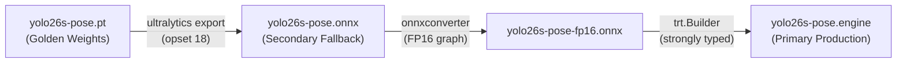

# ADR-006 — Production Inference Runtime Selection for RTX 3070 and Fallback Tiers

- **Status:** Accepted
- **Date:** 2026-09-23
- **Deciders:** VISION, PERF, OPS, Muse COORD

## Context

ElderCare Vision requires a reliable, ultra-low-latency, and memory-efficient pose inference pipeline for continuous 24/7 fall detection. Phase 9 conducted reproducible benchmarks on the target NVIDIA GeForce RTX 3070 8GB GPU across three candidate runtime implementations using the baseline `yolo26s-pose` model architecture:
1. Native PyTorch CUDA (`yolo26s-pose.pt`, FP32)
2. ONNX Runtime CUDA (`yolo26s-pose.onnx`, opset 18, FP32)
3. TensorRT 11 FP16 Engine (`yolo26s-pose.engine`, FP16)

This ADR formalizes the production runtime hierarchy based on measured empirical performance, resource utilization, and operational deployment characteristics.

---

## 1. Measured Facts (Benchmark Evidence on RTX 3070 8GB)

All measurements conducted across 3 repetitions of 300 measured frames (900 total measured frames) + 40 warmup frames per run, using deterministic synthetic 640x480 RGB frames (seed 42), with explicit `torch.cuda.synchronize()` instrumentation:

| Metric / Dimension | PyTorch Baseline (P9-002) | ONNX Runtime CUDA (P9-003) | TensorRT FP16 (P9-004) |
|---|---|---|---|
| **Runtime Implementation** | PyTorch 2.5.1 + CUDA 12.1 | ONNX Runtime 1.23.2 CUDA | TensorRT 11.3.0.99 FP16 |
| **Model Checkpoint / File** | `yolo26s-pose.pt` | `yolo26s-pose.onnx` | `yolo26s-pose.engine` |
| **Inference Precision** | FP32 | FP32 (opset 18, onnxslim) | FP16 (strongly-typed plan) |
| **Median Throughput (FPS)** | **64.54 FPS** | **105.33 FPS** (+63.2%) | **212.91 FPS** (+229.9% / 3.30x) |
| **Mean Total Latency** | **13.436 ms** | **8.377 ms** (-37.7%) | **4.125 ms** (-69.3%) |
| **Median Latency (p50)** | **13.209 ms** | **8.333 ms** | **4.101 ms** |
| **p90 Latency** | **13.956 ms** | **8.542 ms** | **4.270 ms** |
| **p95 Latency** | **14.352 ms** | **8.673 ms** | **4.351 ms** |
| **p99 Latency** | **16.649 ms** | **9.531 ms** | **4.614 ms** |
| **Synchronized Inference (Mean)** | **13.365 ms** | **8.311 ms** | **4.062 ms** |
| **Peak Torch Alloc VRAM** | **104.01 MB** | **7.65 MB** | **12.34 MB** |
| **Host Process RSS Peak** | **1535.34 MB** | **1715.54 MB** | **1342.82 MB** |
| **Artifact File Size** | **23.0 MB** | **39.9 MB** | **111.0 MB** |
| **17-Keypoint Contract Parity** | Reference (Exact) | Verified Parity | Verified Parity |
| **Run-to-Run CV Stability** | **1.24%** | **0.23%** | **0.55%** |
| **Operational Complexity** | Low (direct PyTorch) | Medium (ONNX wheel) | High (GPU-specific engine build) |

---

## 2. Engineering Decisions

### Decision 1: Primary Production Runtime — TensorRT 11 FP16
- **Selection:** `yolo26s-pose.engine` (TensorRT 11 FP16) is the **Primary Runtime** for all NVIDIA GPU hosts.
- **Rationale:**
  - **3.30x Throughput & 69.3% Latency Reduction:** At 212.91 FPS and 4.125 ms mean latency, TensorRT FP16 provides exceptional headroom (>7x real-time margin), freeing substantial GPU capacity for concurrent multi-camera feeds and downstream VLM inference.
  - **Sub-5ms Worst-Case:** Guaranteed p99 latency of 4.614 ms prevents frame drops or queue lag during sudden motion bursts.
  - **Lowest Host Memory:** Lowest peak RSS footprint (1342.82 MB) among all tested GPU runtimes.

### Decision 2: Secondary / Fallback Runtime — ONNX Runtime (CUDA / CPU)
- **Selection:** `yolo26s-pose.onnx` is designated as the **Primary Portable Fallback Runtime**.
- **Rationale:**
  - Provides a high-performance, architecture-neutral fallback (105.33 FPS on CUDA, or CPU fallback via `CPUExecutionProvider`) whenever TensorRT engines need compilation or when deployed on heterogeneous hardware.
  - Does not require GPU-specific engine pre-compilation.

### Decision 3: Source of Truth & Reference Checkpoint — PyTorch (.pt)
- **Selection:** `yolo26s-pose.pt` remains the single **Golden Source of Truth**.
- **Rationale:**
  - All ONNX models and TensorRT engines are deterministically exported and compiled directly from `yolo26s-pose.pt` via `scripts/export_tensorrt_fp16.py`.
  - PyTorch serves as the ground truth reference for accuracy and contract regression testing in CI.

---

## 3. Build & Deployment Pipeline



Build command:
```bash
python scripts/export_tensorrt_fp16.py --weights yolo26s-pose.pt --out yolo26s-pose.engine
```

---

## 4. Consequences

- **Positive:**
  - Production deployments achieve >200 FPS throughput and <4.5 ms latency on the target RTX 3070.
  - Clean three-tier runtime hierarchy: TensorRT (fastest) -> ONNX (portable fallback) -> PyTorch (reference).
  - Reproducible single-command build script eliminates manual build drift.
- **Negative / Mitigations:**
  - TensorRT engines are hardware/driver-specific and cannot be transferred across different GPU microarchitectures without recompilation.
  - *Mitigation:* `scripts/export_tensorrt_fp16.py` automates on-device compilation during host initialization, with seamless fallback to ONNX Runtime if engine compilation is pending.
